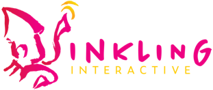

# Hey, gang 🦑

Inkling Interactive is a small interactive media studio founded in 2018. We are proudly
headquartered in Melbourne, Australia, with contributors from San Francisco, USA and elsewhere.

We're adventurous and serious about art and technology; a team with deep-sea spark.

## Our Team 🎳

Everybody on our team is part of the creative process. Our producers, technologists, artists,
musicians, and writers are part of the same creative process that builds our products.

Our favourite kind of product is interactive narrative media: games that feature engaging and
thought-provoking stories across a variety of themes. We enjoy realistic fiction, fantasy, and
science fiction the most!

## Open Source 👩‍💻

Our rule is that any technology-involved project that can be made open source - especially tools -
will always be open-sourced. We have followed that process and intend to do so for the foreseeable
future.

## Cheers 🙏

Please look forward to our coming works!
